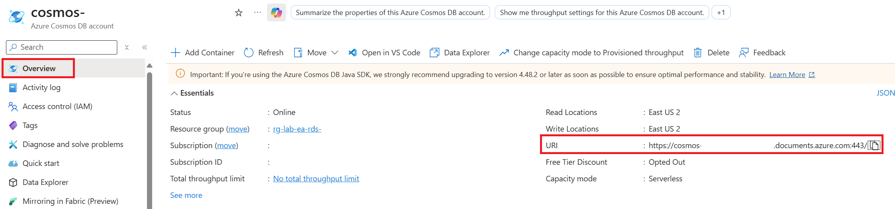
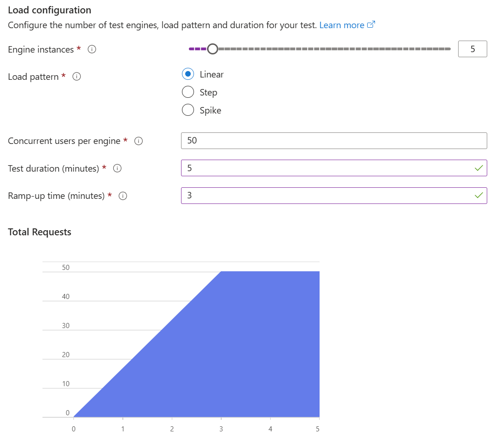

# Azure Managed Redis in the Azure World

Welcome to this Azure Managed Redis Workshop. You will be experimenting with Azure Managed Redis in multiple labs to discover how it's integrated to other Azure services by running a real world scenarios. Don't worry, even if the challenges will increase in difficulty, this is a step by step lab, you will be guided through the whole process.

During this workshop you will have the instructions to complete each steps. It is recommended to search for the answers in the provided resources and links before looking at the solutions placed under the **📚 Toggle solution** panel for a challenge based learning experience.

## 🚀 Dev Environment Setup

Before starting this lab, be sure to set your Azure environment :

- An Azure Subscription with the **Contributor** role to create and manage the labs' resources and deploy the infrastructure as code
- A dedicated resource group for this lab to ease the cleanup at the end.
- Register the Azure providers on your Azure Subscription if not done yet: `Microsoft.CognitiveServices`, `Microsoft.DocumentDB`, `Microsoft.EventGrid`, `Microsoft.KeyVault`, `Microsoft.Logic`, `Microsoft.SignalRService`, `Microsoft.Web`

To retrieve the lab content :

- A Github account (Free, Team or Enterprise)
- Create a [fork][repo-fork] of the repository from the **main** branch to help you keep track of your changes

3 development options are available:

- 🥇 _Preferred method_ : Pre-configured GitHub Codespace
- 🥈 Local Devcontainer
- 🥉 Local Dev Environment with all the prerequisites detailed below

<div class="tip" data-title="Tips">

> To focus on the main purpose of the lab, we encourage the usage of devcontainers/codespace as they abstract the dev environment configuration, and avoid potential local dependencies conflict.
>
> You could decide to run everything without relying on a devcontainer : To do so, make sure you install all the prerequisites detailed below.

</div>

### 🥇 : Pre-configured GitHub Codespace

To use a Github Codespace, you will need :

- [A GitHub Account][github-account]

Github Codespace offers the ability to run a complete dev environment (Visual Studio Code, Extensions, Tools, Secure port forwarding etc.) on a dedicated virtual machine.
The configuration for the environment is defined in the `.devcontainer` folder, making sure everyone gets to develop and practice on identical environments : No more conflict on dependencies or missing tools !

Every Github account (even the free ones) grants access to 120 vcpu hours per month, _**for free**_. A 2 vcpu dedicated environment is enough for the purpose of the lab, meaning you could run such environment for 60 hours a month at no cost!

To get your codespace ready for the labs, here are a few steps to execute :

- After you forked the repo, click on `<> Code`, `Codespaces` tab and then click on the `+` button:


- You can also provision a beefier configuration by defining creation options and select the **Machine Type** you like :


### 🥈 : Using a local Devcontainer

This repo comes with a Devcontainer configuration that will let you open a fully configured dev environment from your local Visual Studio Code, while still being completely isolated from the rest of your local machine configuration : No more dependancy conflict.
Here are the required tools to do so :

- [Git client][git-client]
- [Docker Desktop][docker-desktop] running
- [Visual Studio Code][vs-code] installed

Start by cloning the Hands-on-lab-Serverless repo you just forked on your local Machine and open the local folder in Visual Studio Code.
Once you have cloned the repository locally, make sure Docker Desktop is up and running and open the cloned repository in Visual Studio Code.

You will be prompted to open the project in a Dev Container. Click on `Reopen in Container`.

If you are not prompted by Visual Studio Code, you can open the command palette (`Ctrl + Shift + P`) and search for `Reopen in Container` and select it:


### 🥉 : Using your own local environment

The following tools and access will be necessary to run the lab in good conditions on a local environment :

- [Git client][git-client]
- [Visual Studio Code][vs-code] installed (you will use Dev Containers)
- [Azure CLI][az-cli-install] installed on your machine
- [Azure Developer CLI][azd-cli] installed on your machine
- [Azure Functions Core Tools][az-func-core-tools] installed, this will be useful for creating the scaffold of your Azure Functions using command line.
- If you are using VS Code, you can also install the [Azure Function extension][azure-function-vs-code-extension]
- The 3 following languages if you want to run all the Azure Functions solutions :

  - [.Net 7][download-dotnet]
  - [Python 3.x][download-python]
  - [Node 18][download-node]

  <!-- TODO: Clean if not possible to redis-cli via MSEntra Auth -->

- Optional : [Redis CLI][redis-cli] installed to test a few commands in the introductory Lab 1. Not necessary if you're familiar with the basics of Redis.

Once you have set up your local environment, you can clone the Hands-on-lab-serverless repo you just forked on your machine, and open the local folder in Visual Studio Code and head to the next step.

## 🚀 Visual Studio Code Setup

### 👉 Load the Workspace

Once your environment is ready, you will have to enter the Visual Studio Workspace to get all the tools ready.
To do so, click the **burger menu** in the top left corner (visible only with codespace), **File** and then **Open Workspace from File...**


 <!-- TODO: Update the image with a white background pointing at the right code-workspace file -->

- Select `.vscode/hands-on-lab-azure-managed-redis.code-workspace` :

  

- You are now ready to go! For the rest of the lab, in case you lose the terminal, you can press `Ctrl + J` or open a new one here :


Let's begin!

### 🔑 Sign in to Azure

<div class="task" data-title="Task">

> - Log into your Azure subscription in your environment using Azure CLI and on the [Azure Portal][az-portal] using your credentials.
> - Instructions and solutions will be given for the Azure CLI, but you can also use the Azure Portal if you prefer.
> - Register the Azure providers on your Azure Subscription if not done yet: `Microsoft.Web`, `Microsoft.OperationalInsights`, `Microsoft.Cache`, `Microsoft.ApiManagement`, `Microsoft.DocumentDB`

</div>

<details>

<summary>📚 Toggle solution</summary>

```bash
# Login to Azure :
# --tenant : Optional | In case your Azure account has access to multiple tenants

# Option 1 : Local Environment
az login --tenant <yourtenantid or domain.com>
# Option 2 : Github Codespace : you might need to specify --use-device-code parameter to ease the az cli authentication process
az login --use-device-code --tenant <yourtenantid or domain.com>

# Display your account details
az account show
# Select your Azure subscription Id
az account set --subscription <subscription-id>

# Register the following Azure providers if they are not already
# App Service & Azure Functions
az provider register --namespace 'Microsoft.Web'
# Azure Monitor
az provider register --namespace 'Microsoft.OperationalInsights'
# Azure Managed Redis
az provider register --namespace 'Microsoft.Cache'
# API Management
az provider register --namespace 'Microsoft.ApiManagement'
# Azure Cosmos DB
az provider register --namespace 'Microsoft.DocumentDB'
# Azure Load Testing
az provider registter --namespace 'Microsoft.
```

</details>

<div class="task" data-title="Task">

> You will find the instructions and expected configurations for each Lab step in these yellow **Task** boxes.
> Inputs and parameters to select will be defined, all the rest can remain as default as it has no impact on the scenario.

</div>

[repo-fork]: https://github.com/microsoft/hands-on-lab-redis/fork
[azure-vs-code-extension]: https://marketplace.visualstudio.com/items?itemName=ms-vscode.vscode-node-azure-pack
[az-cli-install]: https://learn.microsoft.com/en-us/cli/azure/install-azure-cli
[azd-cli]: https://learn.microsoft.com/en-us/azure/developer/azure-developer-cli/install-azd?tabs=winget-windows%2Cbrew-mac%2Cscript-linux&pivots=os-windows
[az-func-core-tools]: https://learn.microsoft.com/en-us/azure/azure-functions/functions-run-local?tabs=v4%2Clinux%2Ccsharp%2Cportal%2Cbash#install-the-azure-functions-core-tools
[az-func-languages]: https://learn.microsoft.com/en-us/azure/azure-functions/functions-versions#languages
[az-naming-convention]: https://learn.microsoft.com/en-us/azure/cloud-adoption-framework/ready/azure-best-practices/resource-naming
[az-abrevation]: https://learn.microsoft.com/en-us/azure/cloud-adoption-framework/ready/azure-best-practices/resource-abbreviations
[az-portal]: https://portal.azure.com
[vs-code]: https://code.visualstudio.com/
[azure-function-vs-code-extension]: https://marketplace.visualstudio.com/items?itemName=ms-azuretools.vscode-azurefunctions
[docker-desktop]: https://www.docker.com/products/docker-desktop/
[git-client]: https://git-scm.com/downloads
[github-account]: https://github.com/join
[download-dotnet]: https://dotnet.microsoft.com/en-us/download/dotnet/7.0
[download-python]: https://www.python.org/downloads/
[download-node]: https://nodejs.org/en

<!-- TODO: Clean if not possible to redis-cli via MSentra -->

[redis-cli]: https://learn.microsoft.com/fr-fr/azure/redis/how-to-redis-cli-tool

---

# Lab 1 : Azure Managed Redis

## Setting up the infrastructure in Azure

If you look at the project, you will see an `infra` folder. It contains the infrastructure as code that you will use to deploy the infrastructure for this Hands On Lab. This will deploy a series of Azure services that you will use in combination with Azure Managed Redis.

You will deploy it using Azure Developer CLI (azd):

First, init the environment:

```bash
azd init -l eastus2 -e dev
```

Next, provision the resources and the code source of the lab:

```bash
azd up
```

<div class="warning" data-title="Warning">

> The deployment can take up to 25 minutes : Make sure to keep your codespace or local environment running during the infrastructure creation.

</div>

## Architecture overview

While you are deploying the infrastructure of the labs, let's discover it together:


The architecture is composed of the following elements:

- An App Service that will host an API and store the data in Azure Cosmos DB
- An APIM instance which will be used as a facade for the APIs
- An Azure Managed Redis that will be used to cache the data of the API
- A first Azure Function that will be triggered by an event of the Azure Managed Redis to refresh the cache when the data expires
- A second Azure Function that will be used to retrieve and store the navigation history of a specific user in Azure Managed Redis
- An Azure Load Testing instance for later load tests
- Azure AI Foundry with a few model deployments for the purpose of the Hands on Lab
- Azure Monitor that will be used to monitor the Azure Managed Redis

You will discover all these elements during this Hands On Lab.

## Seed the database

In this Hands On Lab, you will use a Azure Cosmos DB to store and retrieve your data. To save time, you will seed it with some data.

To do this, download the [zip file][database-seed-zip] that contains the data to seed your database, then unzip it and you will find a `products.json` file.

Go to your resource group, search the Azure Cosmos DB account, select it and in the left menu, click on **Data Explorer**. Then on the database called `catalogdb` and click on the `products` container and select `Items` like below:


Then, click on the **Upload Item** button and select the `products.json` file you just downloaded and click **Upload**. This will upload the data in your database:


_The number of products in the screenshot can differ from the number of products you have in your file._

Now, if you close the **Upload Item** window and click on the **Refresh** button, you should see the data in your database:


You have now seeded your database with the data for this Hands On Lab.

## Redis basics

<!-- TODO: Add a few descriptions from the doc + SKUs definitions below -->

To be able to use Azure Managed Redis, you need to understand the basics of Redis. Redis is an open source, in-memory data structure store, used as a database, cache, and message broker. It supports data structures such as strings, hashes, lists, sets, sorted sets with range queries, bitmaps, hyperloglogs, geospatial indexes with radius queries and streams.

These structures are available with any of the pricing tiers available for an Azure Managed Redis:

- **Basic**: An OSS Redis cache running on a single VM. This tier has no service-level agreement (SLA) and is ideal for development/test and noncritical workloads.
- **Standard**: An OSS Redis cache running on two VMs in a replicated configuration.
- **Premium**: High-performance OSS Redis caches. This tier offers higher throughput, lower latency, better availability, and more features. Premium caches are deployed on more powerful VMs compared to the VMs for Basic or Standard caches.
- **Enterprise**: High-performance caches **powered by Redis Inc.’s Redis Enterprise software**. This tier supports Redis modules including RediSearch, RedisBloom, RedisJSON, and RedisTimeSeries. Also, it offers even higher availability than the Premium tier.
- **Enterprise Flash**: Cost-effective large caches powered by Redis Inc.’s Redis Enterprise software. This tier extends Redis data storage to nonvolatile memory, which is cheaper than DRAM, on a VM. It reduces the overall per-GB memory cost.

<!-- TODO: Remove this part if there is no way to connect the Redis-CLI with the MSEntra Authentication. -->

<!-- Let's see quickly how to interact with Azure Managed Redis. Go to your resource group, search the Azure Managed Redis resource, select it and in the left menu, click on **Overview** and click on the **Console** button:


Now inside the console, let's play with basic Redis commands.

Run the following command to set a key/value pair in Redis:

```bash
set key1 myvalue1
```

To retrieve the value of the key, run the command:

```bash
get key1
```

To check if a key exists in Redis, just run:

```bash
exists key1
```

To delete a specific key in Redis, run the command:

```bash
del key1
```

Run the following commands to set a key with an expiration of 10 seconds in Redis:

```bash
set key1 myvalue1
expire key1 10
```

After 10 seconds, if you run the `get` command on `key1`, you will see that the key will return `nil` which means that the key doesn't exist anymore.

To test if Redis is working, you can run the `ping` command:

```bash
ping
```

It should return `PONG` which means that Redis is working.

 -->

The following commands are the most basic one to interact with Redis:

- `set` [key] [value]: Sets a key/value in the cache. Returns `OK` on success.
- `get` [key]: Gets a value from the cache.
- `exists` [key]: Returns `1` if the key exists in the cache, otherwise `0` if it doesn’t.
- `del` [key]: Deletes the value associated with the key.
- `expire` [key] [value in seconds]: Expires the key after the specified number of seconds.
- `ping`: Ping the server. Returns `PONG`.

<div class="tip" data-title="Tips">

> While you are going to use some of these data structures through the course of this lab, it will mainly focus on scenarios showing how to connect Azure Services with Azure Managed Redis.
>
> You might want to practice basic Redis commands with another lab focused on [interacting with Redis Data Structures][redis-practice-lab].

</div>

[static-web-app-overview]: https://learn.microsoft.com/en-us/azure/static-web-apps/overview
[static-web-app-cli]: https://aka.ms/swa/cli-local-development
[static-web-app-code]: https://github.com/microsoft/hands-on-lab-redis/tree/main/src/catalog-webapp
[database-seed-zip]: https://github.com/microsoft/hands-on-lab-redis/releases/download/latest/database-sample-data.zip
[redis-practice-lab]: https://azure.github.io/redis-on-azure-workshop/

---

# Lab 2 : Use Azure Managed Redis in your API

In this lab, you will see how to use Azure Managed Redis in your API to improve its performance. This API is an ASP.NET Web API written in .NET 8 and you will use the [StackExchange.Redis][stackexchange-redis] NuGet package to interact with Redis. One of the goal of this API is to provide a list of products that you will display in a web application.

<div class="tip" data-title="Tips">

> Redis Cache has a set of different clients to connect to it. For your real world scenario, pick the client that fits your preferred development language as detailed [here][redis-dev-clients] : All of these are compatible with Azure Managed Redis instances.

</div>

## Run the API

<div class="info" data-title="Note">

> This lab relies on two different data store systems : Azure Cosmos DB and Azure Managed Redis. While Redis queries are faster than the ones sent to a Serverless Azure Cosmos DB instance (mainly thanks to the **In-Memory data storage**), the overall latency difference on end to end API call might not be so clearly noticeable.
> In average, pure Azure Managed Redis calls come back under 1 ms, while a Serverless Azure Cosmos DB Instance will respond in a few milliseconds.
>
> Between the performance optimizations at a Serverless Azure Cosmos DB Instance doors, the scenario with a single user calling the API combined with such a small volume of `products` data persisted in Azure Cosmos DB, the end to end API response time discrepancy between Azure Managed Redis and Cosmos DB can be reduced.
>
> To clearly identify calls' response with or without cache, you'll add an artificial high latency while interacting with Azure Cosmos DB .
> To do so, you'll find an environment variable in appsettings.json.template named `SIMULATED_DB_LATENCY_IN_SECONDS` that you'll have to fill in : The rest of the application code is ready to take this value into account.

</div>

Open the `src/catalog-api` folder in Visual Studio Code in your active devcontainer or GitHub Codespace.

For the moment, the API is only connecting to Azure Cosmos DB to retrieve the products list persisted in the `products` container. To have this interaction with Azure Cosmos DB work, you will need to configure your catalog-api.

The configuration file format is provided in `src/catalog-api/appsettings.json.template` and will need to be duplicated in a new file called `src/catalog-api/appsettings.Development.json`.
Once duplicated, you will need to fill in the missing values in this new file to configure the app.

<div class="task" data-title="Task">

> - Set the Azure Cosmos DB Ednpoint in the `appsettings.Development.json` file
> - Set the Redis Endpoint in the `appsettings.Development.json` file (in preparation for the next lab)
> - Set `SIMULATED_DB_LATENCY_IN_SECONDS` to `"1"`
> - Run the API in your devcontainer or using the provided GitHub Codespace.
> - Call the GET `/products` endpoint to confirm that the API is working

</div>

<details>

<summary>📚 Toggle solution</summary>

Start by duplicating the `appsettings.json.template` from Visual Studio Code file explorer to `appsettings.Development.json` OR by running the following command :

```bash
cd src/catalog-api
cp appsettings.json.template appsettings.Development.json
```

Inside the Azure Portal, go to your resource group, search for the Azure Cosmos DBaccount, select it and in the left menu, click on **Keys**. Then copy the **URI** and replace `"AZURE_COSMOSDB_ENDPOINT"` value in `appsettings.Development.json` :



Then inside the Azure Portal, go to your resource group, search the Azure Managed Redis instance, then copy the **Endpoint** value and replace `"AZURE_REDIS_ENDPOINT"` value in the `appsettings.Development.json` file :


You can set `SIMULATED_DB_LATENCY_IN_SECONDS` to `"1"` to create artificial latency to ease perception over cache/no cache data retrieval response time.

You can now run debug for the catalog-api by selecting **Run and Debug** in the left menu, select `.Net Core Launch (web)` and click the green arrow :


**If you get an exeception about HTTPS, please run the command in the terminal**

```bash
cd src/catalog-api
dotnet dev-certs https
```

Depending on the environment you are using :

- Github Codespace :

  - Once the API is running, click on the **ports** tab in the bottom part of Visual Studio Code window.
  - Right click on port `5076` and click **Open in Browser**.
  - You can now browse for http://<your-unique-domain-&-port>/products and you should see the list of products.

- Devcontainer :
  - Once the API is running, browse for the url: http://localhost:5076/products and you should see the list of products.

</details>

## Add caching to your API

The goal of this part is to set up the logic to interact with Azure Managed Redis to store and retrieve the products list, and improve the overall latency of the `/products` endpoint.
Most of the bricks you will need for the lab are provided in the `ProductCacheService.cs` class preconfigured for you. You will need to implement the caching logic using these bricks to complete the lab.

If you open it you will see two methods:

- `GetProductsAsync`: This method is used to get the products from the cache
- `SetProductsAsync`: This method is used to set the products in the cache

They both use the `IRedisService` interface to interact with the cache and use the mechanism of serialization/deserialization to store and retrieve data. This interface and the standard interaction methods to any Redis Cache come from the `StackExchange.Redis` Nuget Package already referenced in `src/catalog-api/Catalog.Api.csproj`

<div class="tip" data-title="Tips">

> These Get & Set Async methods have been built specifically for this lab to simplify exception handling and serialization as much as possible in your interaction with Azure Managed Redis.
> However, the actual Get and Set queries sent to the Redis Cache reside in the simple methods provided by the StackExchange.Redis package, and that you can see in the `RedisService.cs` class as the extract below :
>
> ```csharp
> await database.StringGetAsync(key);
> ...
> await database.StringSetAsync(key, value);
> ```

</div>

Now it is time to work with Azure Managed Redis to retrieve and return the list of products provided by the persistence tier played by Azure Cosmos DB in this lab's scenario.

If no product exists in your Azure Managed Redis Instance, then you will need to retrieve a fresh list of products from your persisting database (Azure Cosmos DB) and rehydrate the cache with this fresh data.
This way, the next call will extract the list of products directly from the cache, improving the overall request performance, as well as freeing up resources for the database to focus on actual data persistence activities.

<div class="task" data-title="Tasks">

> - Open the `ProductEndpoints.cs` file
> - Use the `IProductCacheService` to setup the caching logic for the `/products` endpoint

</div>

<details>
<summary>📚 Toggle solution</summary>

Inside the `ProductEndpoints.cs` file and in the `/products` endpoint use `IProductCacheService` to retrieve the products from the cache. If some products are found in the cache, return them directly:

```csharp
IEnumerable<Product>? cachedProducts = await productCacheService.GetProductsAsync();

if (cachedProducts != null) {
    Console.WriteLine("Returning product list from the cache");
    return Results.Ok(cachedProducts);
}
```

If no product is found in the cache, fetch the data from Azure Cosmos DBand store them in the cache before returning them:

```csharp
// Fetch data from Cosmos DB
var products = await cosmosService.RetrieveAllProductsAsync();

// Writing the products in cache for future requests
if (products.Any()) {
    await productCacheService.SetProductsAsync(products);
}

return Results.Ok(products);
```

So the final code of the endpoint should look like this:

```csharp
app.MapGet("/products", async (ICosmosService cosmosService, IProductCacheService productCacheService) => {
    IEnumerable<Product>? cachedProducts = await productCacheService.GetProductsAsync();

    if (cachedProducts != null) {
        Console.WriteLine("Returning product list from the cache");
        return Results.Ok(cachedProducts);
    }

    // Fetch data from Cosmos DB
    var products = await cosmosService.RetrieveAllProductsAsync();

    // Writing the products in cache for future requests
    if (products.Any()) {
        await productCacheService.SetProductsAsync(products);
    }

    return Results.Ok(products);
});
```

Now, if you run your API again and call the `/products` endpoint, you should see the response time of your API reduced to a few milliseconds!

Thanks Redis! ;)

</details>

## Deploy the API to Azure

Now that you have your API working locally, you will deploy it to Azure. To do this, you will use the Azure App Service provided by the Terraform infrastructure as code applied earlier. This service allows you to host your APIs and Web Apps in the cloud.

All the environment variables such as the endpoints to Azure Managed Redis and Azure Cosmos DB were already configured in the Azure App Service for you by the infrastructure as code.

<div class="task" data-title="Tasks">

> - Execute the azd deploy command for the catalog-api only.
> - Test the `/products` endpoint of the api hosted in the Azure App Service Resource

</div>

<details>
<summary>📚 Toggle solution</summary>

To deploy your API directly to the Azure App Service resource, you will use the `azd deploy` command from the terminal (Ctrl+J to open the terminal if closed) and test the `/products` api endpoint.

```bash
azd deploy catalog-api
```

Once the api is deployed, we will test it against the `/products` endpoint. To do so, use the `catalog.http` file saved in the `http` folder and click on the `Send request` link above the `Lab 2 - Test the Catalog API` request :


You should see a panel opening on the right part of the `catalog.http` tab showing the result of the request after a few seconds of execution :


This panel shows the result of the `/products` GET request, as well as the time it took to respond.

</details>

<div class="tip" data-title="Tips">

> You might need to restart the Web App to apply the changes and properly test your `/products` endpoint
> 

</div>

You now have an API running in Azure App Service that is able to test the impact of a caching system by switching the following environment variables :

- SIMULATED_DB_LATENCY_IN_SECONDS : Integer value voluntarily increasing the delay before responding from database to help identifying a response coming from the cache or the database
- PRODUCT_LIST_CACHE_DISABLE : 0 (Enable) and 1(Disable) the Redis caching system for steps in the lab.

[redis-dev-clients]: https://redis.io/docs/clients/
[stackexchange-redis]: https://www.nuget.org/packages/StackExchange.Redis

---

# Lab 3 : Add cache to your API with APIM

In the previous lab, you saw how to add code in your API to be able to use an Azure Managed Redis. In this lab, you will see how to add a cache to your API without modifing its code.

## Architecture reminder

If you look at the architecture that you deployed for this workshop, remember that you have an API Management (APIM) in front of the API that provide you the different products.


APIM is used as a facade for all your APIs (in this case you only have one), in the next section you will discover how to add a cache on your APIs using the APIM and Azure Managed Redis.

## Disabling cache in your API

In the previous lab, you added code in your API to use an Azure Managed Redis directly on the `/products` endpoint. To avoid modifying the code of your API, we have added an environment variable called `PRODUCT_LIST_CACHE_DISABLE` that you can use to enable or disable the cache on this endpoint.

To disable the cache, you need to set the value of this environment variable to `1`. To do this, go to your resource group, search the App service, select it and in the left menu, click on **Environment variables**.
You will see the `PRODUCT_LIST_CACHE_DISABLE` environment variable, select the edit button:


and set the value to `1` and click on the **Apply** button.

Now if you try to refresh the list of products by calling the `/products` endpoint of the Catalog API (see Lab 2 `http/catalog.http` file) you should see the response time increasing again due to CosmosDb query only (cache disabled), plus the artificial time increase we added to identify easily cached vs non-cached responses.


## Check APIM External Cache

After disabling the caching of the list of products in the application code, it is time to enable it from APIM.

Infrastructure as code already linked the Azure Managed Redis Instance for any APIM external cache requirements, and you should be able to check the configuration it already did by opening the `External Cache` panel from the APIM resource.

<div class="task" data-title="Tasks">

> - Inside your APIM resource, navigate to the `external cache` panel to look at the `default` cache configuration

</div>

<div class="tip" data-title="tips">

> - As of today, APIM supports connecting to an external cache only by using a connection string
> - If you need to configure your own External Cache, make sure to enable the `Access Keys Authentication` on the Redis Instance before trying to set the link

</div>

<details>
<summary>📚 Toggle solution</summary>

Open your resource group, search the API Management service (APIM), select it and in the left menu, click on **External cache**.


You should see a `default` external cache entry linking the Azure Managed Redis Instance used in the lab.


While the Infrastructure as code already did the configuration for the default external cache resource, you have the ability to link various Azure Managed Redis instances that would be geo-specific, or active geo-replicated replicas of an Azure Managed Redis Replication Group. Having different external caches allows APIM to route the caching operations to the closest Azure Managed Redis instance:


</details>

### Setup APIM Cache Policy globally

Now the Azure Managed Redis instance is linked as the default external cache available to APIM, you need to configure the actual API requests that will need to be cached. APIM allows such a caching mechanism through policy configuration, that can be configured at different levels :

- Global
- Product
- API
- Operation

For an easy configuration, you will activate the caching mechanism to external-cache for all the operations of the API that is available in your APIM instance.

API Management also offers a strict OAuth2 validation process where the JWT claims can be validated granularly to correspond to strong zero trust strategies to control API access, but this is not the purpose of this lab, so we will simplify the authentication to API Management via a simple validate-jwt policy.

<div class="task" data-title="Tasks">

> - Using the interface add the policies `cache-lookup` and `cache-store` to cache all the operations of your API
> - Set the duration to `30` seconds for the cache to be able to test it
> - Implement a basic jwt validation policy to secure the access to your `products` api
> - Test the `Get Products` api twice to validate the impact of caching the results

</div>

<div class="tip" data-title="Tips">

> - You can find more information about APIM policies here:<br> > [Cache Lookup Policy][cache-lookup-policy]<br> > [Cache Store Policy][cache-store-policy]<br> > [Validate JWT][validate-jwt-policy]
> - A lab dedicated to APIM is also available to discover the advanced capabilities of the Azure API Management Service : [Azure API Management Hands on Lab][hol-apim]

</div>

<details>
<summary>📚 Toggle solution</summary>

To be able to compare the performance of your API with and without the cache, you will first call it without the cache using the `products.http` inside the `http` folder.

You will start by adding the authorization policy to protect the access to the API. In the `Products/All Operations` view, click the **</>** button in the Inbound Processing Panel and add the following :


```xml
    <validate-jwt header-name="Authorization" failed-validation-httpcode="401">
        <openid-config url="https://login.microsoftonline.com/<YOUR-TENANT-DOMAIN>/.well-known/openid-configuration" />
    </validate-jwt>
```

Replace the `<YOUR-TENANT-DOMAIN>` value in the `<openid-config>` element with the result of the following command :

```bash
az account show --query "tenantDefaultDomain" -o tsv
# It should look something like contoso.onmicrosoft.com
```

Your inbound policy should like this :


To authorize the call to the API, you will need to request an access-token to send in the Authorization Http header as defined in the `validate-jwt` policy earlier. A simple token will allow access to the api as no claim or audience will be checked by the policy: It's basically just validating the request is given a valid access token generated by MSEntra ID.

Use the following command to generate an access token for Redis (no matter what the content is, the policy is just going to validate a well formed access token):

```bash
az login --use-device-code --scope https://redis.azure.com/.default

az account get-access-token --scope https://redis.azure.com/.default --query "accessToken" -o tsv
```

Copy the result and paste it in the `http/products.http/@access-token` variable :


You can now test the `GET /products` endpoint with the `products.http` file and you should see the response time of your API taking a few seconds:


To reduce this time you will specify a policy to use the cache. From the APIM `API` panel, select the `Products` Api and select **All operations** in the **Inbound processing** section. Then click on the **+ Add policy** button:


Select the cache-lookup/store policy and click on **Add** :


Set the duration to `30` seconds for the cache to be able to test it and click **Save**:


In real life scenario, this value will depend on your business needs.

That's it! You now have your cache and OAuth autorization policy set up for all the operations hosted in your `Products` API. The first call to an operation will hit the backend and cache the response for this endpoint. Starting from the next call, up to the retention delay (30 seconds in our scenario), the response will come from the cache directly, without hitting the backend API anymore, returning way faster. Send another request to the same endpoint a few times to see the impact of caching the results of the API with Redis.

</details>

### Caching a specific operation

In the previous section, you saw how to setup a cache policy globally for all your operations. But what if you want to cache only a specific operation, a product catalog while making sure a news feed endpoint always returns the latest news for example ?

Before testing this scenario, you need to remove the global cache policy you just added. To do this, go to the **All operations** section of your API and click on the **...** button of the **cache-lookup** and the **cache-store** policies and select **Delete**:


Then click on the **Save** button.

<div class="task" data-title="Tasks">

> - This task is a more advanced one, you will need to edit the policy manually
> - Set the policies `cache-lookup-value` and `cache-store-value` to cache only the **Get Products** operation
> - Set the duration to `60` seconds for the cache to be able to test it
> - Define the cache type as `external`
> - You will need to use the `return-response` in the `inbound` block of the policy to return the result of the cache directly if it exists

</div>

<div class="tip" data-title="Tips">

> You can find more information about the cache policies here:<br> > [Cache Lookup Value Policy][cache-lookup-value-policy]<br> > [Cache Store Value Policy][cache-store-value-policy]

</div>

<details>
<summary>📚 Toggle solution</summary>

To cache only the **Get Products** operation you need to specify the redis cache key. To be able to do this you will use two policies: `cache-lookup-value` and `cache-store-value`. They are a bit different from the previous policies as they allow you to specify the key to use in the cache.

This time, you will need to edit the policy manually. So go to the **Get Products** operation and click one of the **Policy code editor** button:


Then, inside the editor replace the `inbound` block of the policy with the following content:

```xml
<inbound>
    <base />
    <cache-lookup-value key="products:all" variable-name="allproducts" caching-type="external" />
    <choose>
        <when condition="@(context.Variables.ContainsKey("allproducts"))">
            <return-response>
                <set-status code="200" reason="OK" />
                <set-header name="Content-Type" exists-action="override">
                    <value>application/json</value>
                </set-header>
                <set-body>@((string)context.Variables["allproducts"])</set-body>
            </return-response>
        </when>
        <otherwise />
    </choose>
</inbound>
```

This policy will first try to get the value from the cache using the key `products:all` and if it exists, it will return it directly using the `return-response`. If it doesn't exist, it will continue the execution of the call and execute other policies if any.

Then, add the following policy in the outbound block of the policy:

```xml
<outbound>
    <base />
    <cache-store-value key="products:all" value="@((string)context.Response.Body.As<string>(preserveContent: true))" duration="60" caching-type="external" />
</outbound>
```

This policy will store the result of the operation in the cache using the key `products:all` and the value of the response body. It will store it for 60 seconds. Of course, you can change the key and the duration to fit your needs.

Notice the `external` cache type is used in both policies. This is because you are using an external cache which is Azure Managed Redis in your case. If you were using the internal cache of the APIM, you would have used the `internal` cache type.

Then, click on the **Save** button.

You can now test your API again with the `products.http` file like previously and you should see the response time of this particular operation reduced to a few milliseconds, but this time only for the **Get Products** operation.

This behaviour mainly helps at managing the caching lifecycle (or [caching invalidations][cache-invalidation]) depending on the type of content :

- A list of flight destinations might be cached for a long period : 1 week (time to live) might be acceptable as new destinations might be added from now.
- However, the pricing of a flight might be prone to the current percentage of booking or market interest for a specific destination, and caching those prices might need to be updated more frequently : A caching time to live of a few minutes might be more appropriate.

Having the ability to apply the caching policy at the operation level allows for granular data freshness even for a wide API providing with a wide variety of operations.
APIM acting as a facade in front of the APIs even allows for implementing a caching mechanism even for legacy application without the need for app evolutions.

</details>

[cache-lookup-policy]: https://learn.microsoft.com/en-us/azure/api-management/cache-lookup-policy
[cache-store-policy]: https://learn.microsoft.com/en-us/azure/api-management/cache-store-policy
[cache-lookup-value-policy]: https://learn.microsoft.com/en-us/azure/api-management/cache-lookup-value-policy
[cache-store-value-policy]: https://learn.microsoft.com/en-us/azure/api-management/cache-store-value-policy
[validate-jwt-policy]: https://learn.microsoft.com/en-us/azure/api-management/validate-jwt-policy
[cache-invalidation]: https://redis.io/glossary/cache-invalidation/
[hol-apim]: https://azure.github.io/apim-lab/

---

# Lab 4 : Event-Driven Architecture

In this lab you will see how to create cloud-native applications which can integrate with Azure Managed Redis.

You will have to create 2 Function Apps which react to changes in Redis to perform an action:

- `cache-refresh-func`: detect expired cache keys and trigger a cache warm up to re-populate them
- `history-func`: process browsing history events from a Redis Stream and expose them via an HTTP API

## Lab 4.1: Refresh the cache

In the previous lab about APIM you saw how to add a cache to your API without modifying its code. In this lab you will see how to refresh the cache when the data expired before the data is requested by the user.

The idea is to use an [Azure Function][azure-function-overview] triggered by an Azure Managed Redis event to refresh the cache when the data expired.

Azure Functions is a serverless solution that provides up-to-date compute resources, so you don't need to worry about deploying and maintaining infrastructure. It offers a common function programming model for various languages, allowing you to focus on your code while Azure Functions handles the rest.

Azure Functions are event-driven and triggered by events from various sources. The model uses `triggers` and `bindings` to avoid hardcoding access to other services:

- Bindings connect other resources to the function declaratively
- Triggers define how a function is invoked and provide associated data as a parameter payload.

Azure Functions run on the App Service platform, which provides features such as deployment slots, continuous deployment, HTTPS support, and hybrid connections. They can be deployed in the Consumption (Serverless), dedicated App Service Plan, or Premium Plan models.

### Keyspace Notifications

While Azure Managed Redis manages the wraping of Keyspace events, it's mandatory to detail the event types you're interested in.

To do so, you'll set the maximum level of notification possible to notify all the existing events in the Azure Managed Redis **Advanced Settings** and **notify-keyspace-events**:


<div class="tip" data-title="Tips">

> Resources : You'll find more insights [here][key-notifications-setup] on the events type that can be notified to fine-tune the notifications' scope

</div>

### Redis Triggered Azure Function

Open the Azure Function project in Visual Studio Code which is under `src/cache-refresh-func` and go to the `RefreshProductsCache.cs`. You will discover a method called `ProductsEventsTrigger` which is empty.

This method has an attribute called `RedisPubSubTrigger` which is used to trigger the function when an event is raised by the Azure Managed Redis.

<div class="task" data-title="Tasks">

> - Define the conditions to trigger the function based on the expiration of a key in the Azure Managed Redis
> - The connection name of the Azure Managed Redis is defined by the environment variables prefixed with `AZURE_REDIS_CONNECTION`

</div>

<div class="tip" data-title="Tips">

> You can find more information about the keys here:<br>
>
> - The Azure Function here use the isolated process mode but at this time the documentation is not updated so use the in-process tab to see examples: [Key Binding][key-bindings]<br>
> - [Redis key notification][key-notifications]<br>

</div>

<details>
<summary>📚 Toggle solution</summary>

The `RedisPubSubTrigger` attribute is used to trigger the function when an event is raised by the Azure Managed Redis, so the first parameter is the connection name (prefix for all environment variables controlling the connection) and the second one is the event pattern to listen to.

The connection string environment key `AZURE_REDIS_CONNECTION` can be specified directly because Azure Functions automatically understands that it is a connection string. Then based on the [Redis key notification documentation][key-notifications] you can use the `expired` event so the pattern to listen to the expiration event of a key will be `__keyevent@0__:expired`.

So the definition of the function should look like this:

```csharp
public async Task ProductsEventsTrigger(
    [RedisPubSubTrigger("AZURE_REDIS_CONNECTION", "__keyevent@0__:expired")] string key)
```

</details>

### Refresh the Redis Cache

Now that we have defined the conditions to trigger the function, we need to implement the logic to refresh the cache.

The key to listen to is defined in the `local.settings.json.template` file in the `REDIS_KEY_PRODUCTS_ALL` environment variable. This environment variable is set to `products:all` which is the key that you used in the previous lab to store the products in the cache.

All environment variables are defined in the `local.settings.json` that you must create if you want to run this Azure Function locally (you just have to copy paste the template from the `local.settings.json.template` file).

If you run this Azure Function and listen to the expired keys in the Azure Managed Redis, you will see that the function is triggered when a key with a suffix of `products:all` is expired. In fact this is because APIM add a prefix to it to avoid conflicts with other keys so you can see a key like `1_products:all` for instance.

<div class="task" data-title="Tasks">

> The goal is to detect when the cache is expired and to refresh it for the `products:all` key.
>
> - Only refresh the cache if the key contains `products:all`
> - Use the `Const.cs` file to point to the `REDIS_KEY_PRODUCTS_ALL` environment variable
> - Call the Catalog Api endpoint in APIM using the `IHttpClientFactory` object provided to retrieve the `products`
> - Only this method should be modified
> - Send a GET request on your APIM `/products` endpoint to trigger the first cache hydration

</div>

<details>
<summary>📚 Toggle solution</summary>

First you need to check if the key contains `products:all` and if it does, you need to refresh the cache.

Then call the Catalog API `/products` endpoint in APIM using the `IHttpClientFactory` object provided to retrieve the `products` using the `GetStringAsync()`. For the purpose of the lab, no need to manage the HTTP Response from APIM as the sole objective is to request a refresh of the cache, using the `Cache policy` defined in the previous lab.

```csharp
public async Task ProductsEventsTrigger(
    [RedisPubSubTrigger("AZURE_REDIS_CONNECTION", "__keyevent@0__:expired")] string key)
{
    if (key.Contains(Const.REDIS_KEY_PRODUCTS_ALL))
    {
        _logger.LogInformation($"{key} just EXPIRED");

        //Calling APIM to request fresh product catalog from data source after cache expired
        await _httpCatalogApiClient.GetStringAsync("products");

        _logger.LogInformation($"called APIM to force Redis refresh key '{key}' with fresh product catalog from data source.");
    }
}
```

Now, to test and run it locally you need to create the `local.settings.json` file and copy the content of the `local.settings.json.template` file into it.

Then you need to set the `AZURE_REDIS_CONNECTION`-prefixed environment variables to the connection details of your Azure Managed Redis and update the `CATALOG_API_URL` with the url of APIM endpoint for the Catalog API.

The connection string for your Azure Managed Redis can be found in the Azure Portal. Select your Azure Managed Redis resource and in the left menu, click on **Access keys**. Then copy the value of the `Primary connection string` into your `local.settings.json` file.

![Azure Managed Redis connection string][azure-cache-for-redis-connection-string]

To set the `CATALOG_API_URL` environment variable, go to your resource group, search the API Management resource and select it. Then copy the `Gateway URL` found in the **Overview** panel of your API Management.


Your `CATALOG_API_URL` should look like that:

```bash
CATALOG_API_URL = "https://<APIM_GATEWAY_NAME>.azure-api.net"
```

To debug the Cache Refresh Azure Function in VS Code, you will need to start Azurite (an Azure Storage Account emulator required to debug Azure Functions locally) :

- In VS Code, Press `Ctrl + Shift + P`, then search `Azurite: Start` and select this option :


- Then run the Azure Function by clicking on the **Run and Debug** panel and select `Attach to Cache Refresh Function`:


- You can now call the `products` endpoint of your APIM Gateway (GET "https://<APIM_GATEWAY_NAME>.azure-api.net/products") to trigger the initial caching.

- After 60 seconds, you should see your Azure Function process the expiration and calling the APIM `/products` endpoint again : Your cache auto-refresher is now working!


</details>

### Deploy the Azure Function

#### Option 1 : Deploy with VS Code

- Open the Azure extension in VS Code left panel
- Make sure you're signed in to your Azure account
- Open the Function App panel
- Right click on your function app that start with `func-cache` and select `Deploy to Function App...`


#### Option 2 : Deploy with Azure Function Core Tools

Deploy your function using the VS Code extension or by command line:

```bash

func azure functionapp publish <NAME_OF_YOUR_FUNCTION_APP> --dotnet-isolated

```

#### Test the Azure Function

Now if you go to your Azure Function resource, in the **Overview** tab select your function:


Do a few calls to set a value in the cache with your `products.http` file and then inside the **Monitor** tab you should see that the function was triggered when the key `products:all` is expired:


You now have an Azure Function that is triggered every time the key `products:all` is expired and refresh the cache.

## Lab 4.2: Browse history

You have previously created an Azure Function which reacts to cache expiry by listening to keyspace events. In this second part of this lab you will create a second Azure Function called `history-func` which will consume Redis Streams and process incoming Stream entries.

This new Azure Function will power an API for retrieving a user's browsing history (which products the user viewed recently).

The following sequence diagram illustrates how `history-func` gets data updates from `catalog-api` via the Redis Stream and how it serves the browsing history via the HTTP endpoint `/api/history` to the Web App:


### Inspecting product views' stream

First thing first, let's take a look at the Streams currently available on your Azure Managed Redis instance.

The goal is to locate the [Redis Stream][redis-streams] in which the `catalog-api` is adding new items whenever a user views a product. Afterwards you need to inspect that stream and take a look at the events/items added to it.

To do this, there is a variety of tools that you can use to inspect Redis data like the integrated [Redis Console][redis-console] and also the fully-featured GUI [RedisInsight][redis-insight].

<div class="task" data-title="Task">

> - View some products in the Web App to generate items in the stream. You can alternatively call the `/products/:id` endpoint from `catalog-api` like you did in Lab 2.
> - Locate the stream where `catalog-api` publishes product viewing events, named `productViews`.
> - Inspect the items in the Stream using `Redis Console` from the Azure portal.
> - View more products in the Web App and make sure new items get added in the stream.

</div>

<div class="tip" data-title="Tips">

> - [Redis Console][redis-console]
> - [SCAN command][redis-scan-command]
> - [XRANGE command][redis-xrange-command]

</div>

<details>
<summary>📚 Toggle solution</summary>

Open the [Redis Console][redis-console] of your Azure Managed Redis instance.


Then use the [SCAN command][redis-scan-command] to list all keys having a type `stream`:

```sh
SCAN 0 TYPE stream
```

You should see a stream called `productViews`. That is the one we are interested in.


Next, view the list of items in the stream using the [XRANGE command][redis-xrange-command] and the special -/+ special IDs which allow us to get all items within a stream:

```sh
XRANGE productViews - +
```


You should be able to see the following item fields:

- `userId`: The ID of the user who performed the action
- `productId`: The ID of the product which was viewed
- `productTitle`: The title of the product which was viewed
- `date`: The time (in ISO 8601) at which the product was viewed
</details>

[redis-streams]: https://redis.io/docs/data-types/streams/
[redis-console]: https://learn.microsoft.com/en-us/azure/azure-cache-for-redis/cache-configure#redis-console
[redis-scan-command]: https://redis.io/commands/scan/
[redis-xrange-command]: https://redis.io/commands/xrange/#--and--special-ids
[redis-insight]: https://redis.com/redis-enterprise/redis-insight/

### Consuming product views' stream using Azure Functions

Now that you have identified the product views' stream, you will need to update the `history-func` Function App to get triggered whenever a new event gets published to the stream.

<div class="task" data-title="Task">

> - Update the trigger of the function `StreamTrigger` defined in `src/history-func/ProcessProductViews.cs` so that it listens to new items in the product views' stream

</div>

<div class="tip" data-title="Tips">

> - [Sample of Azure Functions' triggers for Redis][redis-triggers-sample]
> - [RedisStreamTrigger][redis-stream-trigger]

</div>

<details>
<summary>📚 Toggle solution</summary>

Update the method `StreamTrigger` and replace the trigger placeholder (the `TODO` comment) with the following code:

```csharp
[RedisStreamTrigger("AZURE_REDIS_CONNECTION", "%PRODUCT_VIEWS_STREAM_NAME%")] string entry
```

This will make the function trigger whenever there is a new item on the stream identified by the environment variable `PRODUCT_VIEWS_STREAM_NAME`. Notice the `%` before and after the environment variable name, this is used to indicate that the value of the environment variable should be used instead of the name of the environment variable.
Azure Function can automatically resolve the value of the environment variables prefixed with `AZURE_REDIS_CONNECTION`, so no need to add `%` before and after.

</details>

### Testing the function locally

Next, you need to ensure that your Azure Function works as expected and manages to process new events.

To do this, make sure that you have a `local.settings.json` file (a template is available in `src/history-func/local.settings.json.template`), run the function locally, then view a new product in the web app and make sure that you see a new event being processed in the Azure Function.

<div class="task" data-title="Task">

> Run the `src/history-func` Azure Function locally and ensure it gets triggered whenever you view new products in the Web App

</div>

<div class="tip" data-title="Tips">

> - Use a different port for this Azure Function (e.g. 7072) as the default port may already be used by the `catalog-api` or another Azure Function.
> - You can use [func start -p 7072][func-start] to listen on port 7072

</div>

<details>
<summary>📚 Toggle solution</summary>

First, you will start by creating a new `local.settings.json` file.

```sh
# Go to the root of the history-func Function App
cd src/history-func

# Create a local.settings.json file from the template
cp local.settings.json.template local.settings.json
```

Then you need to update the value of `AZURE_REDIS_CONNECTION` that you can retrieve in your redis instance:

![Azure Managed Redis connection string][azure-cache-for-redis-connection-string]

Now that you have the required config, you can run the function:

```sh
# Load all dependencies
dotnet restore

# Start the Function App
func start -p 7072
```

Once it starts, you can browse the Web App and ensure new product views' event processing logs appear on your terminal:


</details>

### Retrieving user browsing history using an HTTP endpoint

Lastly, let's check the HTTP endpoint of `history-func` and ensure that it returns all browsing history for a given user.

<div class="task" data-title="Task">

> Call the `/api/history` endpoint and ensure it returns the latest products that you have viewed on the Web App

</div>

<div class="tip" data-title="Tips">

> The `/api/history` is expecting the user ID to be passed in the `X-USER-ID` header, you can get the user ID from the Web App in the top right corner.

</div>

<details>
<summary>📚 Toggle solution</summary>

As the Azure Function is already up and running, you can directly call the `/api/history` endpoint with a GET request and ensure the ID of the user for whom you want to get the history is defined in the `X-USER-ID` header.


Before calling the endpoint, make sure to get a User ID by copying the UUID that you see on the top right of the Web App. You can also get it from the field `userId` in the stream data items.

So the final request should look like this:

<!-- TODO: Update with an .http file request -->

```sh
curl \
    --location 'http://localhost:7072/api/history' \
    --header 'X-USER-ID: <Set the User ID here>'
```

Of course you can test it with an other tool like [Postman][postman-link] for instance.

</details>

### Deploying history-func to Azure

You have confirmed that your code is working fine locally, so now you can proceed to the next step: deploying it to Azure.

<div class="task" data-title="Task">

> Deploy the `history-func` app to Azure on the Azure Function that start with `func-hist`

</div>

<details>
<summary>📚 Toggle solution</summary>

You can do this using the Visual Studio Code extension like you saw in the previous section of this lab or by command line using the Azure Function Core Tools:

```sh
func azure functionapp publish <NAME_OF_YOUR_HISTORY_FUNCTION_APP> --dotnet-isolated
```

</details>

### Viewing browsing history in the Web App

In this last part, you will wire the newly deployed `history-func` app to the Web App using the app setting `HISTORY_API`.

This will allow the Web App to communicate with your new History api (`/api/history`) to retrieve and display the current user's browsing history.


<div class="task" data-title="Task">

> - Update the Web App's app setting `HISTORY_API` to point to the `/api/history` API endpoint of `history-func`.
> - Click on the UUID of the user on the top right of the Web App and make sure you can see your browsing history.

</div>

<details>
<summary>📚 Toggle solution</summary>

To configure the Static Web App to use the new `/api/history` endpoint you will first need to get its full url.

To do that, head to the `history-func` Function App in the Azure Portal, then select the function `GetBrowsingHistory`.


Then select the `Get Function Url` button and copy the function url:


Next, you need to add that url in the `HISTORY_API` app setting of the static web app:


Hit `Save` and wait for the Static Web App to reload then open the url of the Static Web App.

Once it gets loaded, click on the UUID of the user on the top right of the page and ensure you can see the latest products that you have viewed


</details>

[redis-console]: https://learn.microsoft.com/en-us/azure/azure-cache-for-redis/cache-configure#redis-console
[redis-scan-command]: https://redis.io/commands/scan/
[redis-xrange-command]: https://redis.io/commands/xrange/#--and--special-ids
[redis-insight]: https://redis.com/redis-enterprise/redis-insight/
[azure-cache-for-redis-connection-string]: ./assets/azure-cache-for-redis-connection-string.png
[key-bindings]: https://learn.microsoft.com/en-us/azure/azure-functions/functions-bindings-cache-trigger-redispubsub?tabs=in-process%2Cnode-v3%2Cpython-v1&pivots=programming-language-csharp#examples
[key-notifications]: https://redis.io/docs/manual/keyspace-notifications/
[azure-function-overview]: https://learn.microsoft.com/en-us/azure/azure-functions/functions-overview?pivots=programming-language-csharp
[key-notifications-setup]: https://redis.io/docs/manual/keyspace-notifications/#configuration
[redis-triggers-sample]: https://learn.microsoft.com/en-us/azure/azure-cache-for-redis/cache-tutorial-functions-getting-started#set-up-the-example-code
[redis-stream-trigger]: https://learn.microsoft.com/en-us/azure/azure-functions/functions-bindings-cache-trigger-redisstream
[func-start]: https://learn.microsoft.com/en-us/azure/azure-functions/functions-core-tools-reference?tabs=v2#func-start
[postman-link]: https://www.postman.com/

---

# Lab 5 : Azure Managed Redis Governance

In this lab you will discover how to retrieve metrics and logs from Azure Managed Redis to monitor the health of your instance and take informed decisions about its sizing.

## Azure Monitor

To simulate a real world scenario, the first thing to do is to generate some load on the Azure Managed Redis resource. To be able to do this, you already deployed an [Azure Load Testing][azure-load-testing] instance with the Infrastructure as Code executed in Lab 1.

Azure Load Testing is a fully managed service that enables you to generate high-scale load. It simulates traffic for your applications, regardless of where they are hosted. Developers, testers, and quality assurance (QA) engineers can use it to optimize application performance, scalability, and capacity planning. In this part of the lab, you'll use the `URL-based load test` module to quickly set up performance tests against a target endpoint using an HTTP verb and a small set of configuration options. Azure Load Testing also supports more advanced load-testing scenarios with [JMeter][jmeter] or [Locust][locust] scripts.

You will call the APIs developed in the earlier modules of the lab through API Management via and Azure Load Test. Azure Managed Redis will be used to serve the content of the cache via the API Management policy, increasing the traffic on Azure Managed Redis. This will help in generating usage metrics on the resource, used to determine the overall health of the service.

<div class="task" data-title="Task">

> - Create a `URL-based Load Test` configuration in the Azure Load Test instance with `50` vusers for `5` minutes
> - Set a Environment Variable parameter for the Authorization header to be filled during test start
> - Start a new load test for 5 minutes to analyze the impact of this load on the Redis usage and eviction metrics

</div>

<details>

<summary>📚 Toggle solution</summary>

Start by selecting the Azure Load Test instance in your resource group and click **Create a URL-based test** in the `Tests > Tests` panel :


Create a Load test named `ProductsAPI_LoadTesting` and **Add Request** in the `Test Plan` tab:


Add a new request named `Get Products` and set the **URL** of the operation exposed via APIM (which should look like `https://apim-lab-....azure-api.net/products`), and leave the HTTP Method to `GET`.
In the **Headers** tab set a Header named `Authorization` and set the value to `Bearer ${accessToken}` and validate by clicking the **Add** button. Once done, the request should look like the following capture :


Switch to the **Parameters** tab and create and environment variable named `accessToken` and set any value there, it will be replaced at runtime anyways :


Switch to the **Load** tab and set the parameters as follow :

- Engine Instances : 5
- Load Pattern : Linear
- Concurrent User per Engine : 50
- Test Duration Minutes : 5
- Ramp-up Time Minutes : 3
- Leave the rest as default
  

</details>

<div class="tip" data-title="Tips">

> Other performance testing tools specifically designed for Redis benchmarking exist, such as [redislab/memtier_benchmark][memtier-benchmark] and [redis-benchmark][redis-benchmark].
> These utilities exercise your Redis deployment in isolation under expected load profiles to surface Redis‑specific latency or throughput bottlenecks.
> Explore redis performance testing recommandations in the article [here][redis-perf-tools]
>
> However, you should also performance test the end‑to‑end (E2E) application to uncover constraints elsewhere in the stack that only appear under production‑like traffic patterns.
> Platform services like [Azure Load Testing][azure-load-testing] provide capabilities to correlate high load with request success rate, latency, and underlying infrastructure saturation for a holistic view.

</div>

About 5 minutes after the benchmark has successfully ended, open the Azure Portal view on your Azure Managed Redis resource and open the **Insights** panel to gain deeper knowledge of the resource health :


And then inside the **Performance** tab you can check how the resource performed under load :


These metrics are available out of the box, with any Azure Managed Redis SKU and are precious insights to take informed decisions concerning the sizing of your caching resource.

The Azure Managed Redis Enterprise SKU also comes with `autoscaling` capabilities to guarantee necessary caching resources at all times.

Currently, only the Enterprise SKU support the `autoscaling` feature. However, you can do it manually using the `Premium` SKU, enabling the `cluster` option and taking advantage of Azure Monitor Alerts to respond to increasing usage trends and trigger additional node and shard provisionning.

## Usage trend monitoring

Let's create an [alert rule][alert-rule-creation] with Azure Monitor to send an email notification when the CPU average usage of the Azure Managed Redis resource is above `30%` for more than `1` minute. When the alert is triggered, you will send an email to notify the Ops team that the usage trend on Redis increased.

In a real world scenario this alert could be coupled with a request to increase the number of nodes in the cluster to help you respond to usage increase, as well as scale down rule to reduce the number of nodes when demand drops. For simplicity and to avoid scaling delay for the lab, we'll limit to a simple email notification here.

<div class="task" data-title="Task">

> - Create a `static alert rule` to trigger when CPU reaches `30%` on `average` for the past `1` minute
> - Create an [`action group`][action-group-creation] that will be executed by this alert rule
> - The `action group` must send an `email` notification to your email address
> - Execute the memtier_benchmark utility during `5 minutes` to load the Azure Managed Redis CPU and trigger the alert

</div>

<details>

<summary>📚 Toggle solution</summary>

To do so, open the Azure Portal on your Azure Managed Redis resource and open the **Metrics** panel.

In the **Metric** dropdown, select `CPU` and set **Aggregation** to `Avg` and click on **New alert rule** :


In the **Condition** panel you just opened, make sure to fill in the trigger conditions as follows and click **Next: Actions >** :


Now you have the rules set to trigger the notification, it's time to set the actual action that will send the notification.
To do so, click **Create action group**, set the action group to your `resource group`, give it a `name` and `Display name` and click **Next: Notifications >**:


Select the **Notification Type** `Email/SMS message/Push/Voice`, tick **Email** in the panel that just opened and fill in your `email address`, then save by clicking **OK**. Once done, you'll have to give a **Name** to the notification type you just set and click **Review + Create** :


Check the action group you just created is added in the Action Group list and click **Next: Details >**:


Now is time to finalize the configuration of the alert rule: Giving it a `resource group` save location, define the **Severity** to `2 - Warning`, set an `Alert rule name` and check `Enable upon creation`. When done, hit **Review + Create** :


Now the alert is created, you can test it by generating some load on the Azure Managed Redis resource using the [RedisLabs/memtier_benchmark][redis-benchmark] tool like you did before.

Run the same **redis-benchmark** command from your devcontainer/copdespace terminal as earlier, for a 5 minutes benchmark duration :

```bash
docker run --rm redislabs/memtier_benchmark:latest -h <YOUR_REDIS_RESOURCE_NAME>.redis.cache.windows.net -p 6380 -a <YOUR_REDIS_ACCESS_KEY> --test-time=300 --tls --tls-skip-verify
```

After a few minutes, a notification like the following should be sent to your email address :


After the benchmark ended, you will be able to check the trigger history by clicking **Alerts** and then **Alert Rules** in the Azure Managed Redis resource and select the Alert Rule you built in this lab, and open the **history** panel where you should see the alert trigger details :


As a side note, we really encourage you to take the time to dig in the toolbox offered by the Azure Portal to help you quickly **diagnose and solve problems** with the configuration of the resource or the connected clients :


</details>

[alert-rule-creation]: https://learn.microsoft.com/en-us/azure/azure-monitor/alerts/alerts-create-new-alert-rule?tabs=metric
[action-group-creation]: https://learn.microsoft.com/en-us/azure/azure-monitor/alerts/action-groups#create-an-action-group-in-the-azure-portal
[memtier-benchmark]: https://github.com/redislabs/memtier_benchmark
[redis-benchmark]: https://redis.io/docs/latest/operate/oss_and_stack/management/optimization/benchmarks/
[redis-dev-wrapper]: https://github.com/Azure/Microsoft.Azure.StackExchangeRedis/
[jmeter]: https://jmeter.apache.org/usermanual/get-started.html
[locust]: https://locust.io/
[apim-hol]: https://azure.github.io/apim-lab/
[azure-load-testing]: https://learn.microsoft.com/en-us/azure/app-testing/load-testing/overview-what-is-azure-load-testing
[redis-perf-tools]: https://docs.azure.cn/en-us/redis/best-practices-performance

# Closing the workshop

The **Product Hands on Lab : Azure Managed Redis in Azure World** comes to an end : We hope you liked practicing with Azure solutions and that this lab will help you kick start your journey to caching in Azure.
Most of the solution that were quickly presented as a cloud native application integrated with Azure Managed Redis have their dedicated lab to help you practice in depth way with these products.
You can find dedicated labs here :

- [Product Hands-on lab : Azure Serverless Architecture][hol-serverless]
- [Product Hands-on lab : API Management][hol-apim]

Once you're done with this lab you can delete the resource group you created at the beginning.

To do so, click on `delete resource group` in the Azure Portal to delete all the resources and audio content at once.
The following Az-Cli command can also be used to delete the resource group :

```bash
# Delete the resource group with all the resources
az group delete --name <resource-group>
```

[hol-serverless]: https://moaw.dev/workshop/gh:microsoft/hands-on-lab-serverless/main/docs/
[hol-apim]: https://azure.github.io/apim-lab/
